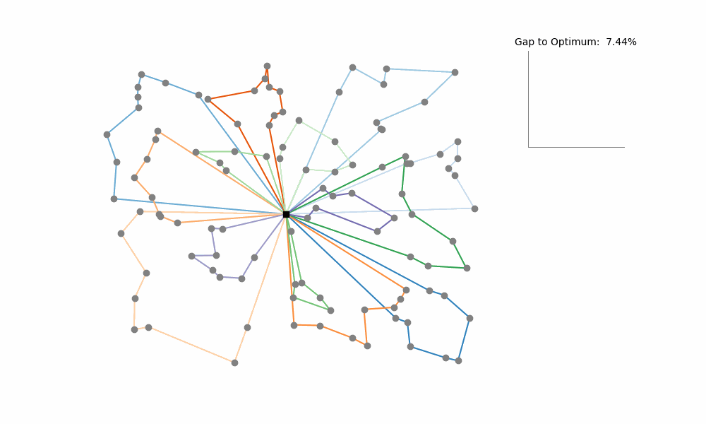

# Guided Local Search for Vehicle Routing Problems

This repository contains a Python implementation of the [Knowledge Guided Local Search]([https://www.sciencedirect.com/science/article/abs/pii/S0305054819300024]) (KGLS).

KGLS is a powerful heuristic for solving the Vehicle Routing Problem (VRP) and its variants.
The algorithm iteratively searches for small, improving changes to the current solution (local search moves). 
When no further improvements can be made, KGLS penalizes unfavorable edges 
(as determined by domain-specific knowledge) 
to escape local optima and explore new parts of the solution space.



___

# Getting Started

## Prerequisites

This implementation requires Python 3.7+ and has minimal dependencies. 
Install matplotlib if you want to visualize solution progress:

```bash
pip install matplotlib
```

## Input Format
KGLS accepts VRP instance files as input. Example files are available in the `examples` directory 
or on the [VRP website](http://vrp.galgos.inf.puc-rio.br/index.php/en/).

## Usage Example

```python 
from kgls import KGLS

# Initialize the solver with a VRP instance file
kgls = KGLS(path_to_instance_file)

# Set the termination condition (e.g., stop after 100 iterations without improvement)
kgls.set_abortion_condition("iterations_without_improvement", 100)

# Run the algorithm and visualize the progress
kgls.run(visualize_progress=True)

# Save the final solution to a file
kgls.to_file(path_to_output_file)
```

For additional usage examples, such as running benchmarks on multiple instances, 
refer to the `examples` directory.

___

## Implemented local search moves

KGLS employs four local search heuristics to iteratively improve the solution.

1. **Segment Relocation**
    Moves a segment of nodes (i.e., either a single or multiple connected nodes) from one route to another. Note: In the original paper Segment Relocations are contained in CROSS Exchange.

2. **CROSS Exchange**
    Exchanges segments between two routes.

3. **Relocation Chain**
    Performs a series of relocation moves (i.e., moving one node to another route), such that the resulting solution remains feasible.

4. **Lin-Kernighan Heuristic**
    A powerful and flexible edge exchange heuristic originally designed for the Travelling Salesman Problem. KGLS uses a simplified implementation to improve routes in themselves.

___

## Contributions
Contributions to this repository are welcome! 
If you have ideas for new features, optimizations, or extensions, feel free to open an issue or submit a pull request.

___

## References
[Original KGLS Paper]([https://www.sciencedirect.com/science/article/abs/pii/S0305054819300024])
[VRP Repository](http://vrp.galgos.inf.puc-rio.br/index.php/en/)

___

## License
This project is licensed under the MIT License. See the LICENSE file for details.

